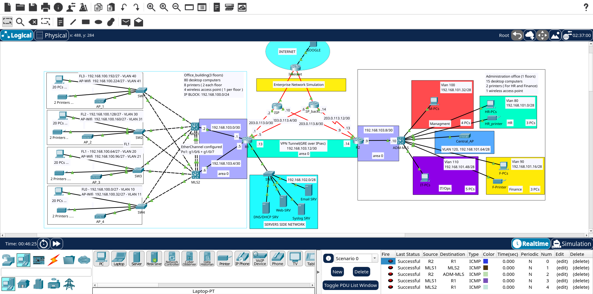

# Kacemi Enterprise Network Simulation

A full enterprise network design and configuration project built in **Cisco Packet Tracer**, simulating a two-site company (Office Building + Administration Office) with redundant routing, VPN connectivity, layered security, centralized monitoring, and internet access via NAT.

Built after completing Jeremy's IT Lab CCNA course, as a way to go beyond guided labs and design, break, debug, and document a network end-to-end on my own.

---

## Topology Overview



- **Office Building** — 4 floors, 80 PCs, 8 printers, 4 Wi-Fi access points, dual-homed to two multilayer core switches (MLS1 / MLS2)
- **Administration Office** — 1 floor, Management / HR / Finance / IT-Ops departments, single multilayer switch (ADM-MLS)
- **Server Farm** — DNS/DHCP, Web, Email, and Syslog servers
- **WAN Edge** — Dual-ISP setup (primary + backup) with a simulated external "Internet" host for end-to-end testing

---

## What's Configured

### Routing & Redundancy
- **OSPF** — single area, dynamic routing across the core
- **HSRP** — gateway redundancy on MLS1/MLS2 (office VLANs) and on the management VLAN, priority-based active/standby
- **EtherChannel** — Port-channel between MLS1 and MLS2 for the core interlink
- **Dual-ISP WAN** — primary (ISP) + backup (ISP_backup), floating static default routes for failover

### Site-to-Site
- **GRE tunnel** — R1 ↔ R2, carrying inter-site traffic
- **IPsec** — encrypting the GRE tunnel (ISAKMP/IKE + ESP)

### Switching
- **VLANs** — 10/11, 20/21, 30/31, 40/41 (office floors, data + Wi-Fi), 80/90/100/110/120 (HR, Finance, Management, IT/Ops, Central AP)
- **Management VLAN (Vlan1)** — 192.168.104.0/28, used for SW1–SW5 management, syslog, and NTP source

### Security
- **Perimeter ACLs** on R1 & R2 — permitting only VPN traffic plus established/echo-reply return traffic
- **Server farm ACL** — restricts access to only the ports each service needs
- **Internal segmentation ACL** — office VLANs isolated from admin VLANs
- **VTY ACL** — management access restricted to the Management VLAN, SSH only

### Address Translation
- **NAT overload (PAT)** on R1 and R2's WAN interfaces, scoped via standard ACLs so VPN traffic is never translated

### Monitoring
- **Syslog** — centralized on 192.168.102.6, all devices sourcing from loopback (or Vlan1 on access switches)
- **NTP** — hierarchical: R1 (master) → MLS1/MLS2/R2 → access switches + ADM-MLS

### Server Farm
- DNS/DHCP, Web (`admcorp.local`), Email, Syslog — all in `192.168.102.0/28`
- A simulated external "Internet" host (Google-style server), reached through NAT, used to validate the entire chain end-to-end

---

## IP Addressing Summary

| Site / Block | Subnet |
|---|---|
| Office Building | 192.168.100.0/24 |
| Administration Office | 192.168.101.0/24 |
| Server Farm | 192.168.102.0/28 |
| Site-to-Site VPN Tunnel | 192.168.103.12/30 |
| Management VLAN | 192.168.104.0/28 |
| WAN (ISP links) | 203.0.113.0/24 |

---

## Known Simulator Limitations

These were investigated and confirmed as **Packet Tracer limitations, not configuration errors** — documented here for transparency:

- **OSPF SPF recalculation bug** — when two multilayer switches advertise the same VLAN subnet at equal OSPF cost (a normal HSRP pattern), Packet Tracer's SPF process intermittently fails to recompute the routing table correctly, even though the LSA database shows correct data. Confirmed via LSA database inspection, not just `show ip route`.
- **HSRP virtual IP does not reliably answer NTP** — pinging the HSRP VIP works, but NTP client requests addressed to the VIP go unanswered in the simulator. Worked around by pointing NTP clients directly at each core switch's real interface IP instead of the VIP.

---

## Tools Used

- Cisco Packet Tracer 9.0
- Simulated services: HTTP, DNS, DHCP, Email, Syslog, NTP

---

## Repo Contents

```
├── topology.png              # Network topology overview
├── Enterprise_Network.pkt    # Main Packet Tracer project file
├── README.md                 # This file
```

---

## Author

Built and documented as a self-directed follow-up to the CCNA curriculum — CCNA gave the vocabulary, this project built the instincts.
